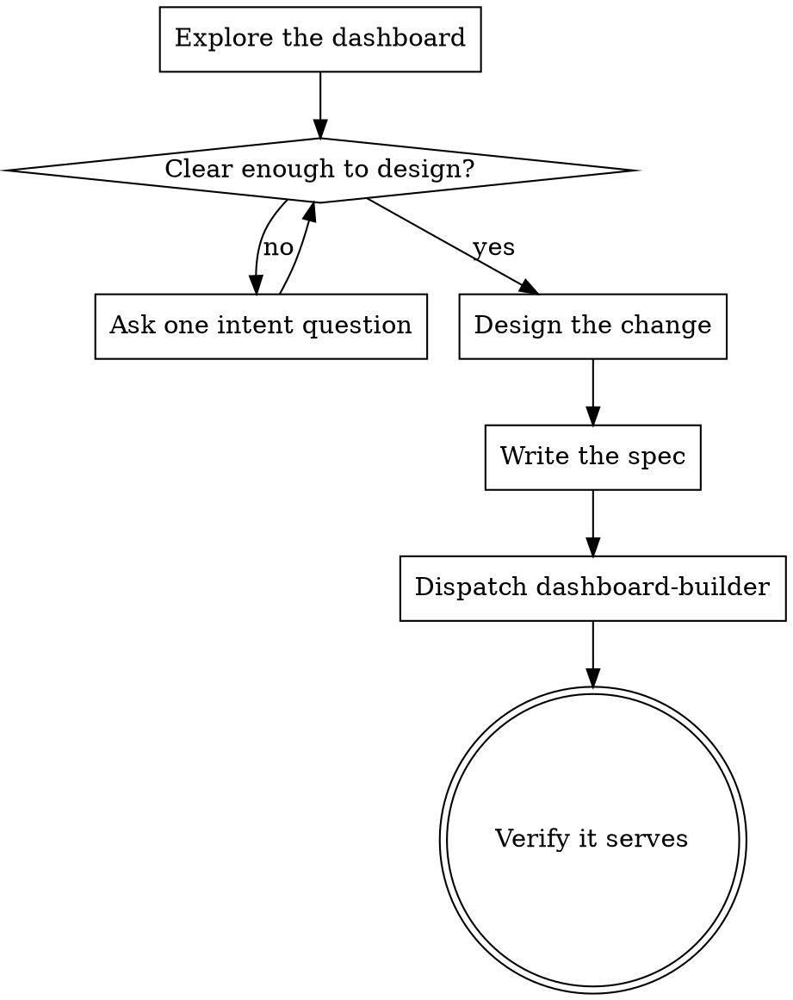

# Dashboard

A React app embedded in the Vesta app, the user's **life HQ**: a personal command center for health, finances, productivity, habits, goals, and anything else they track. It uses a sidebar + page layout.

You do not build the dashboard yourself. You understand what the user wants, design the change, capture it as a spec, and dispatch the `dashboard-builder` subagent (a UI/UX specialist primed on this dashboard) to build it. It works in an isolated context, so the token-heavy build churn (shadcn docs, large React files, vite output) stays out of your conversation; it returns a summary, and you confirm it serves and relay.

**The design is yours.** The user is a non-technical owner: they tell you what they want to see or do, not how to build it. You own every technical and design decision (placement, widgets, layout, data source, visual treatment). Ask the user only to resolve genuine intent, one question at a time, and only when the request is actually ambiguous. Never make them review a design or a spec.

## Checklist

Create a task per item and work them in order:

1. **Explore the dashboard**: read `config.tsx` and the existing pages and widgets, so you build on what is there instead of duplicating it.
2. **Clarify intent (only if needed)**: if the ask is ambiguous, ask the user one focused question at a time about what they want to see or do. Skip this when the ask is already clear.
3. **Design the change**: decide the placement, widgets, layout, data source, and visual treatment yourself.
4. **Write the spec**: a short brief the builder implements (template below).
5. **Dispatch the dashboard-builder**: a general-purpose subagent, filling the template at [dashboard-builder.md](dashboard-builder.md) with your spec.
6. **Verify and relay**: confirm the dashboard actually serves before you tell the user it is done, then summarize what changed in plain terms.

**Exception, dreamer auto-builds.** During a dream pass you may add widgets without asking: compose the spec yourself and dispatch the builder. See the `dream` skill.

## Process flow

## Understanding intent

- Read the current dashboard first (`config.tsx`, pages, widgets) and build on it rather than duplicating.
- The user tells you what they care about, not how to build it. Ask only to resolve real ambiguity: what they want to see, what a number should mean to them, whether something is view only or interactive. One question per message, multiple choice when you can.
- Do not ask about implementation (files, components, styling). Those decisions are yours.

## Designing the change

You own these decisions:

- **Placement**: which page, or a new page or category with a fitting lucide icon. Group related widgets under a meaningful category.
- **Widgets**: what to show, and how to break it into compact cards.
- **Interaction**: view only, or clicks, toggles, and inputs.
- **Data**: sample data, or live data from a skill or API (fetched server side; the dashboard cannot call third party APIs directly). Whether it must persist server side and stay in sync across apps like mobile.
- **Visual**: keep it dense and compact. The builder holds the exact density and sizing rules.

YAGNI: build the smallest thing that satisfies the intent. No speculative widgets.

## The spec

The spec is the one thing that crosses to the subagent, and it cannot ask you anything, so leave nothing open. Name the widgets, the data source, and what "done" looks like, and state what is out of scope so the builder does not overbuild:

    Goal:         <what the user wants to see or do>
    Placement:    <page name, existing or new, with an icon>
    Interaction:  <view-only | clicks/toggles/inputs: describe each>
    Data:         <sample | live from skill/API X; persist and sync across apps? y/n>
    Content:      <the exact metrics, widgets, fields, and layout>
    Out of scope: <what NOT to build, so it does not wander>
    Notes:        <anything the user asked for specifically>
    Done when:    <serves, and shows X>

Example, for a request like "show me my running this week":

    Goal:         See this week's runs at a glance.
    Placement:    Health page (exists); new "Running" widget.
    Interaction:  View-only.
    Data:         Sample for now (last 7 days: date, distance km, pace).
    Content:      One col-span-1 card: this-week total km as the big number, a 7-bar mini
                  chart of daily distance, and last run's pace as a small label.
    Out of scope: No history beyond 7 days, no goals, no live device sync.
    Done when:    Health page shows the Running card and the dashboard serves.

## Dispatch the dashboard-builder

Dispatch a general-purpose subagent, filling the template at [dashboard-builder.md](dashboard-builder.md) with your spec as `{SPEC}`. Give it a strong coding model. It builds in isolation, verifies the app serves, and returns a summary. The subagent cannot ask the user anything, so your spec must be complete.

## Verify and relay

When the builder returns, confirm the dashboard is actually serving before you tell the user it is done: `~/agent/skills/dashboard/scripts/daemon status` reports `http_ok`, or reload the app. Then give the user a short, non-technical summary of what changed. Don't take "done" on faith; a failed build won't tell you.

## Key principles

- **You hold the design.** The user gives intent; you make the calls.
- **One question at a time**, and only to resolve real ambiguity.
- **YAGNI**: the smallest change that satisfies the intent.
- **Build on what exists**: extend pages and widgets rather than duplicating.
- **Verify before done**: confirm it serves, don't assume.
